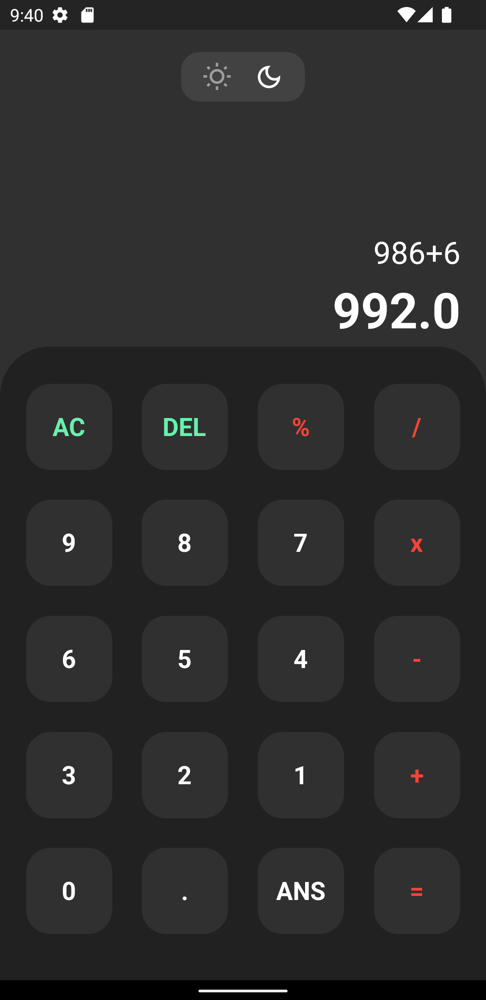
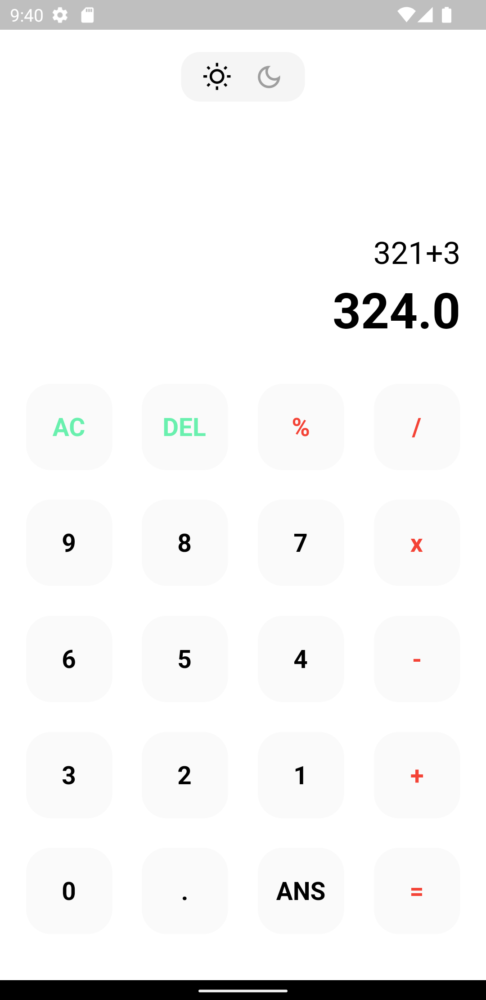
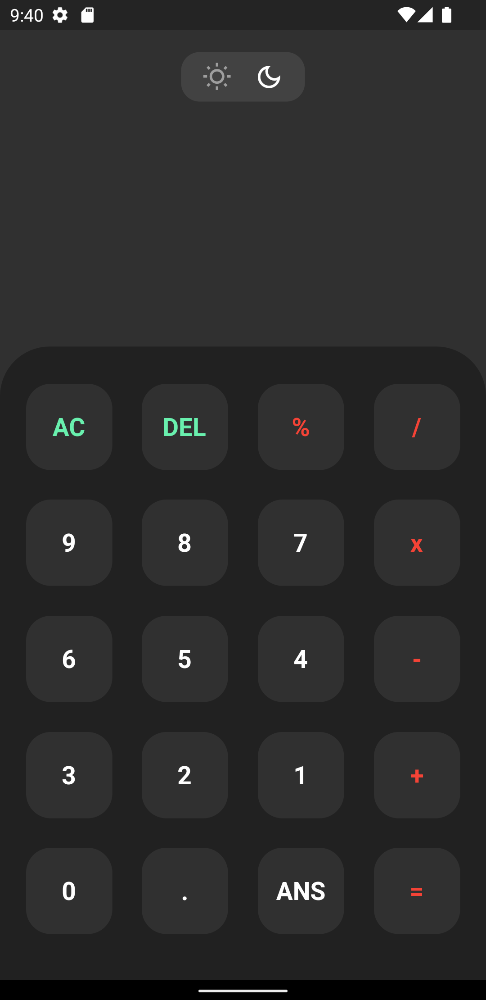

## Calculator App

A very simple calculator app made in FLUTTER.

## Installation Steps
Open CMD where you want to clone the project & run the following commands

```
git clone https://github.com/SafuRaja7/Basic-Calculator.git
cd Basic_Calculator
flutter packages get
flutter run
```

## Screenshots 

           




